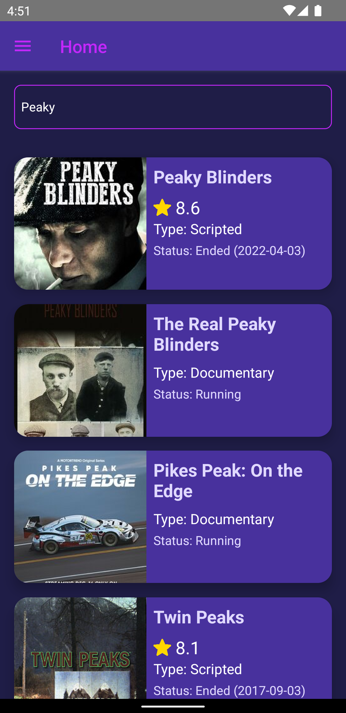
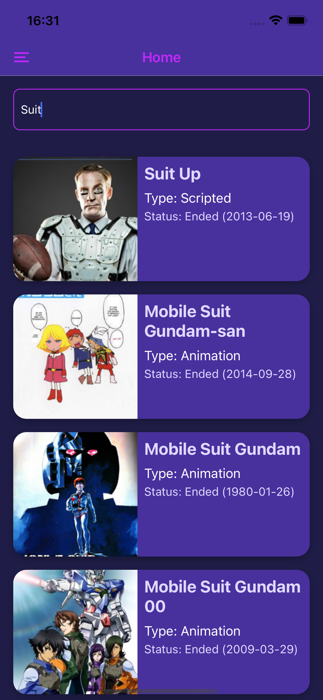
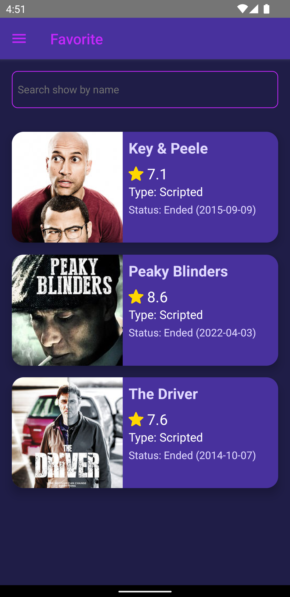
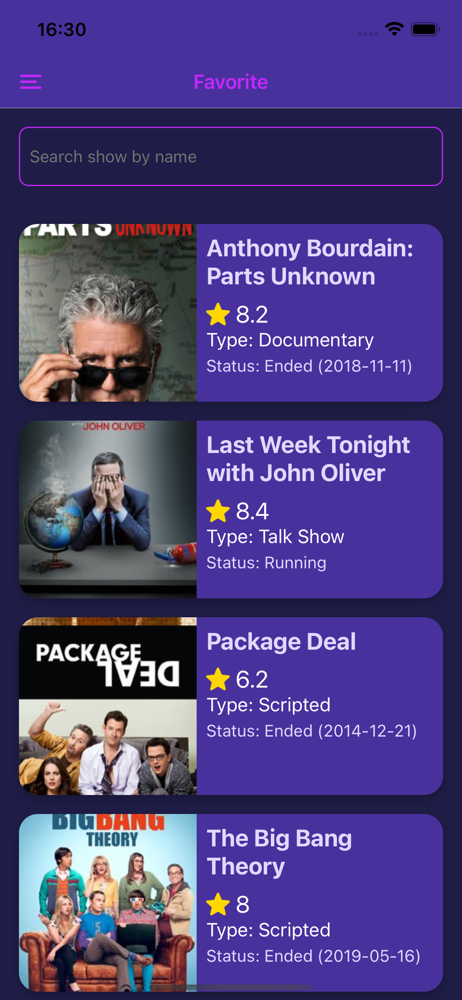
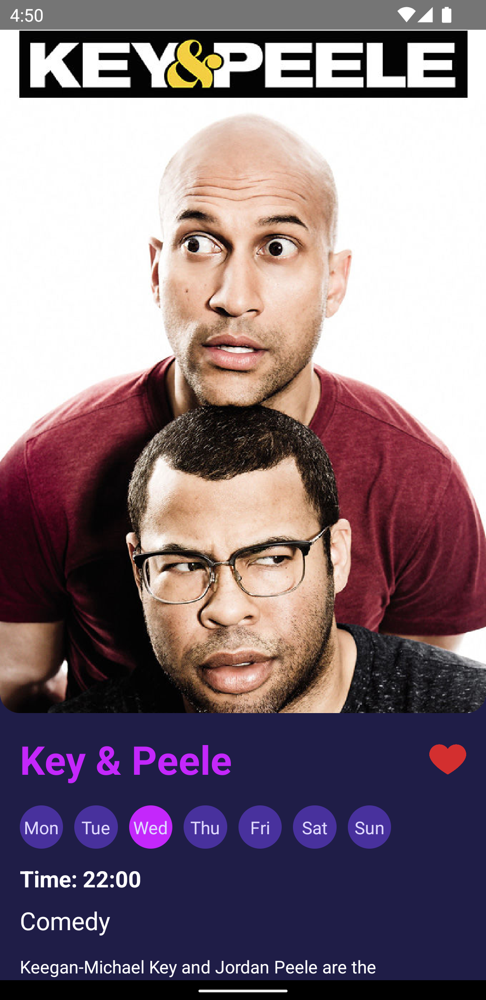
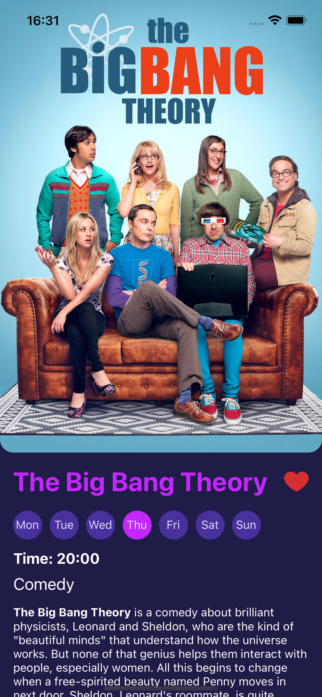
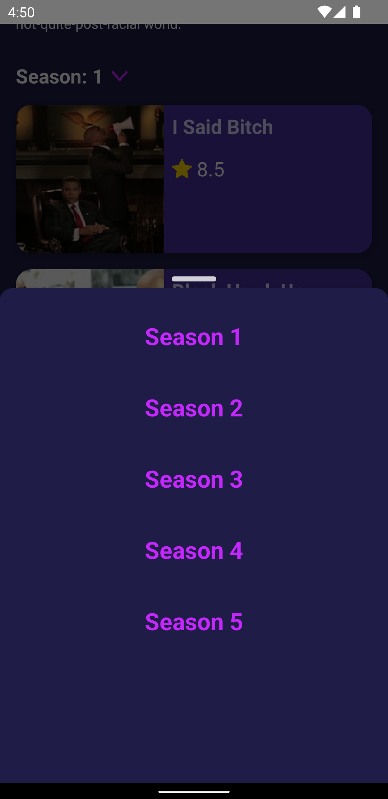
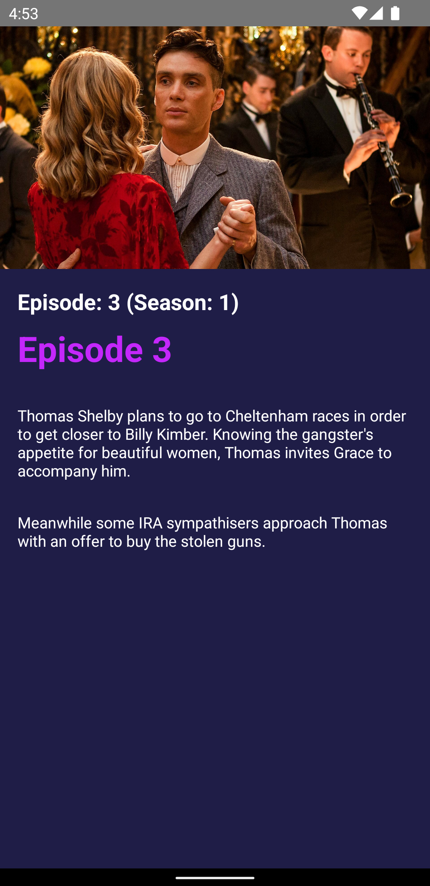
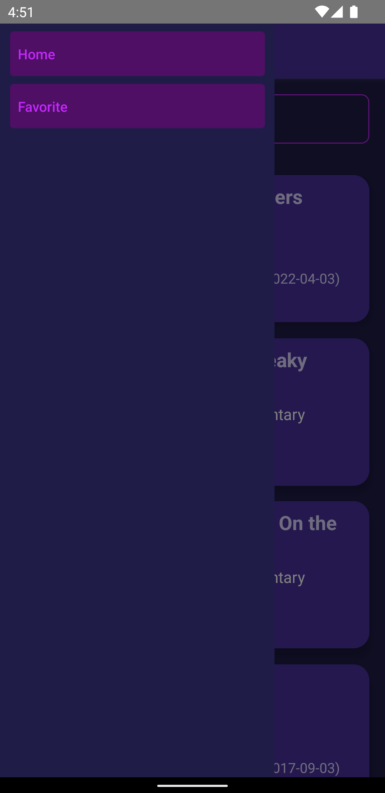
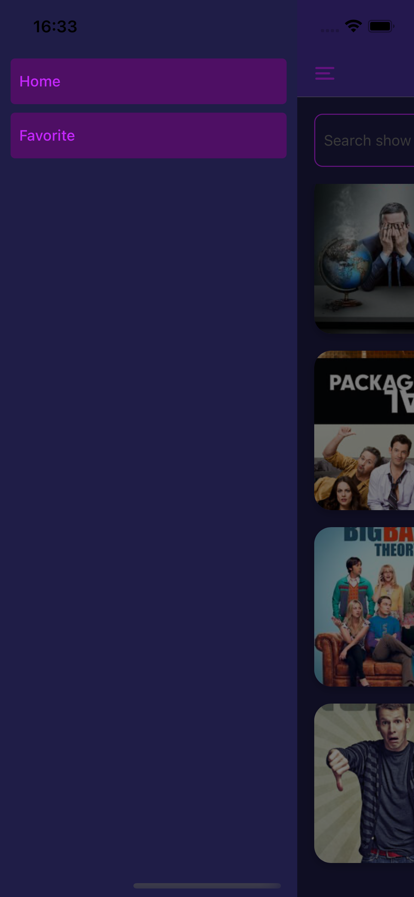

# React Native TVMaze App

This is a React Native App to show information about TV series. The data are fetch from [TVMaze API](https://www.tvmaze.com/api).

### Setup Environment

Project created with React Native CLI.[ See official docs](https://reactnative.dev/docs/environment-setup) to set up the environment.

### Run

**Install dependencies**

```
yarn
```

**Install IOS Pods**

```
cd ios && pod install
```

**Run IOS**

```
yarn ios
```

**Run Android**

```
yarn android
```

### 🛠 Tech and Libraries

- [React Native](https://reactnative.dev/)
- [TypeScript](https://www.typescriptlang.org/)
- [React Navigation](https://reactnavigation.org/): Routing and navigation
- [Async Storage](https://react-native-async-storage.github.io/async-storage/): Data storage system
- [Axios](https://github.com/axios/axios): Promise based HTTP client
- [React Query](https://react-query.tanstack.com/): Fetching, caching, synchronizing and updating server state

### App Screenshots

|                 |                   Android                    |                   IOS                    |
| :-------------: | :------------------------------------------: | :--------------------------------------: |
|   Home Screen   |      |      |
| Favorite Screen |  |  |
|  Show Details   |     |     |
|  Show Seasons   |      |      |
| Episode Details |  |  |
|   Drawer Menu   |      |      |
